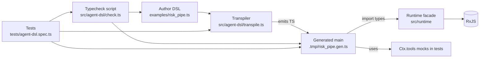
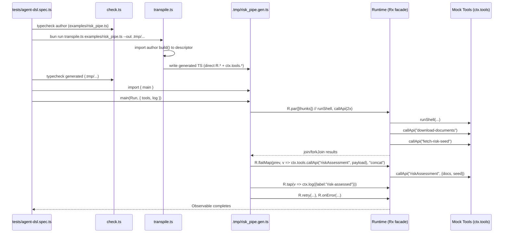
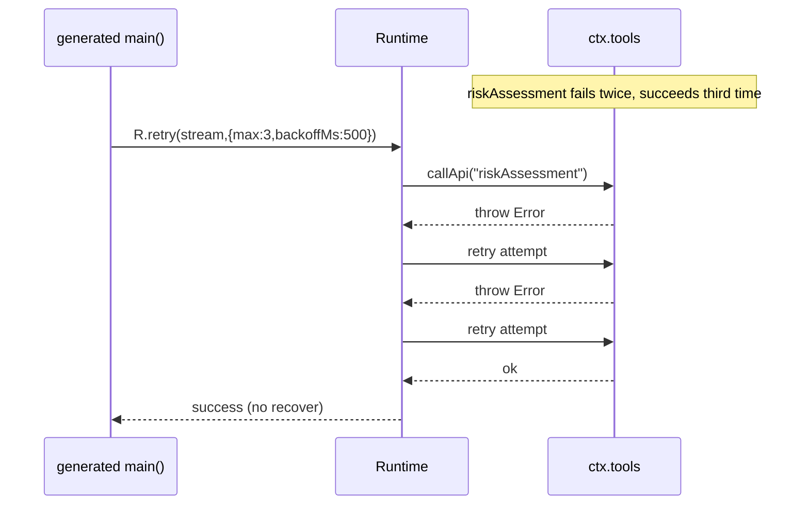

# TypeScript DSL → RxJS Pipelines

A TypeScript DSL for authoring agent pipelines that transpile directly into type‑safe, executable RxJS code — no interpreter at runtime. The DSL focuses on declarative composition, reliability primitives, and testable, observable workflows.

## Project Goals

- Declarative composition: pipelines as clear, typed DSL programs
- Built‑in resilience: retry, backoff, and recovery policies first‑class
- Zero interpreter: transpilation emits executable TS that calls the runtime directly
- Future direction: agents generate DSL programs and orchestrate sub‑agents via the Anthropic client
- Philosophy: observable, testable, composable, agentic, workflows

## Project Status

Early proof‑of‑concept focused on the DSL → transpilation → generated code pipeline. Supporting pieces (storage shims, Anthropic client) are foundation work and not yet integrated into the DSL execution path.

## Quick Start Running agent-dsl Transpilation and Validation

```
# Validate DSL example: 
just dsl-check-author examples/risk_pipe.ts

# Transpile DSL example: 
just dsl-transpile examples/risk_pipe.ts ./.tmp/risk_pipe.gen.ts

# Lint and Validate generated agent: 
just dsl-check-generated ./.tmp/risk_pipe.gen.ts

# Unit Tests (skipping Azurite blob tests): 
POC_AGENT_DSL=1 just test
```


## Deep Dive: Architecture and Flow



- The author DSL never runs the pipeline; it only describes it.
- The transpiler generates a real main(R, ctx) that calls runtime ops directly (no interpreter), then tests drive execution with mock Tools.

### Sequence (what actually happens)



(See assertions for ordering, logging, and retry in the tests.)

### Error flow (retry + recover)



(Validated by the second test: “retries on failure up to max…”.)

### Where to inject mistakes (and how to see them)

Structural error (transpile-time): make `andThen` return a non-alias.

```ts
// BEFORE
andThen(([logs, docs, seed]) => callApi("riskAssessment", { docs, seed })),

// AFTER (broken on purpose)
andThen(([logs, docs, seed]) => ({ hello: "world" } as any)),
```

Run: `just dsl-transpile examples/risk_pipe.ts ./.tmp/risk_pipe.gen.ts` → E_EMIT with loc.

Type error during generated typecheck: break alias name to mismatch Tools.

```ts
// BEFORE
// import { runShell, callApi } from "../src/actions"

// AFTER (broken on purpose)
// export const callApi = alias<...>("callAPI")
```

Run:

```bash
just dsl-transpile examples/risk_pipe.ts ./.tmp/risk_pipe.gen.ts
just dsl-check-generated ./.tmp/risk_pipe.gen.ts  # fails with TS error against Tools
```
