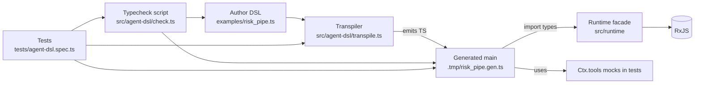
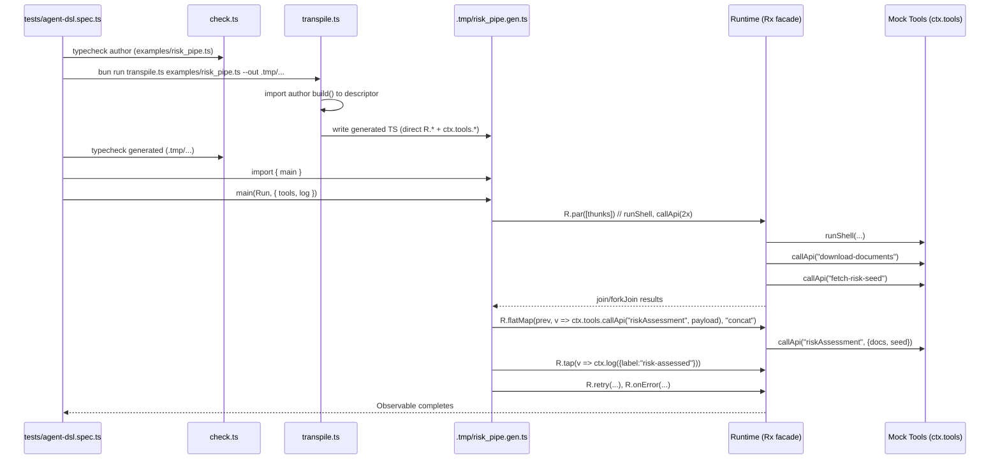
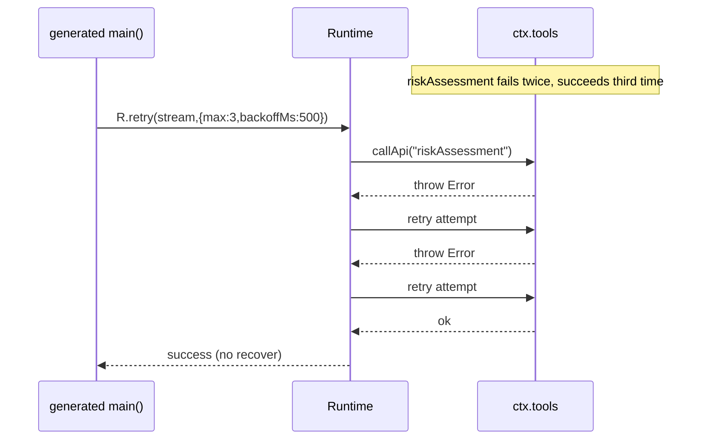
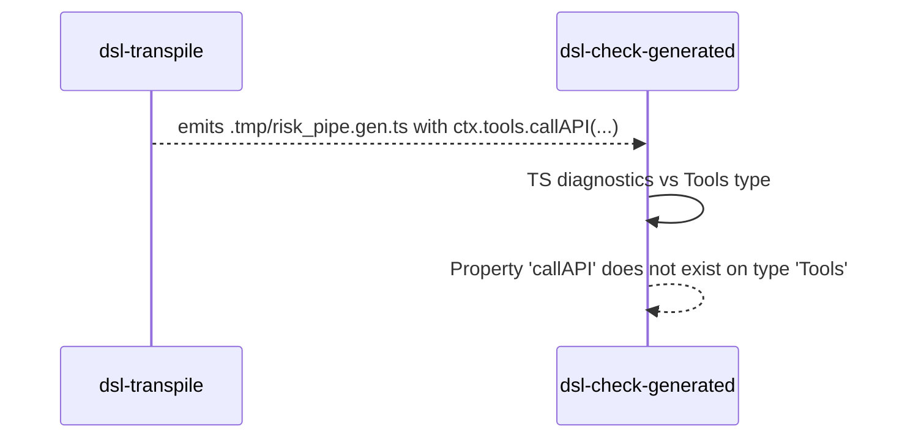

## How it fits (component view)



•	The author DSL never runs the pipeline; it only describes it.
•	The transpiler generates a real main(R, ctx) that calls runtime ops directly (no interpreter), then tests drive execution with mock Tools.  

## What actually happens (sequence diagrams)



(See assertions for ordering, logging, and retry in the tests.)

## Error flow (retry + recover)



(Validated by the second test: “retries on failure up to max…”.)  

## Where to inject mistakes (and how to see them)

Below are two concrete, surgical changes you can make to exercise error handling at different phases of the pipeline. I’ll show exactly what to edit, and which command to run to observe the failure.

Edit examples/risk_pipe.ts:

Change the andThen body to return something that is not an alias/registry call, e.g. return a plain object:

```ts
// BEFORE
andThen(([logs, docs, seed]) => callApi("riskAssessment", { docs, seed })),

// AFTER (broken on purpose)
andThen(([logs, docs, seed]) => ({ hello: "world" } as any)),
```

Why this fails: the transpiler enforces that andThen(...) must yield an alias call so it can lower to ctx.tools.*. It will throw E_EMIT with a location derived from the descriptor’s loc. (See emitAndThenCall + eEmit.)  

Run to see it fail:

```shell
just dsl-transpile examples/risk_pipe.ts ./.tmp/risk_pipe.gen.ts
```

Expected: the transpiler exits non-zero with E_EMIT: andThen must return an alias/registry call @ <file:line:col>.

(If you want another structural failure: make an empty seq—seq()—which also throws at transpile time: “empty seq not supported”.)  

2) Wrong op/function name (caught at generated typecheck OR runtime)

Pick one of these two flavors, depending on which stage you want to exercise:

2a) Type error during generated typecheck (preferred)

Break the alias name to mismatch Tools’s TS type surface.

Edit examples/risk_pipe.ts:

```ts
// BEFORE
const callApi  = alias<(name:string, payload?:unknown)=>Promise<any>>("callApi");

// AFTER (broken on purpose)
const callApi  = alias<(name:string, payload?:unknown)=>Promise<any>>("callAPI"); // note capital I
```

Why this fails: The generated file will call ctx.tools.callAPI(...) but Tools only defines callApi, so the generated file won’t typecheck. You’ll see a TS error pointing into .tmp/risk_pipe.gen.ts when you run step 3. (This demonstrates “wrong function name picked up later in the process”.)  

Run to see it fail:

```shell
just dsl-transpile examples/risk_pipe.ts ./.tmp/risk_pipe.gen.ts   # should still generate
just dsl-check-generated ./.tmp/risk_pipe.gen.ts                   # should FAIL here
```

(Those command names are in the PoC readme.)  

2b) Runtime error (if you want to see recover kick in)

Keep the alias name intact, but change a useTool to a missing kind so ctx.tools[kind] is undefined.

Edit examples/risk_pipe.ts in the recover(...) policy:

```ts
// BEFORE
recover(e => useTool({ kind: "log", level: "error", e }))

// AFTER (broken on purpose)
recover(e => useTool({ kind: "logger", level: "error", e })) // "logger" doesn't exist
```

Run to see it:

```shell
just dsl-transpile examples/risk_pipe.ts ./.tmp/risk_pipe.gen.ts
just dsl-check-generated ./.tmp/risk_pipe.gen.ts   # still passes (type-wise)
just test                                          # FAILS at runtime when recover runs
```

Extra: sequences for the error cases

Structural error (transpile-time)

```mermaid
sequenceDiagram
  participant Check as dsl-check-author
  participant Trans as dsl-transpile
  participant Err as E_EMIT error
  Check->>Check: Typecheck author OK
  Trans->>Trans: Import author; build() -> descriptor
  Trans->>Trans: Walk andThen(...) -> not aliasCall
  Trans-->>Err: throw E_EMIT with loc
```

Generated typecheck error (wrong alias name)



Quick reference: run steps
	•	Author check:
just dsl-check-author examples/risk_pipe.ts  
	•	Transpile:
just dsl-transpile examples/risk_pipe.ts ./.tmp/risk_pipe.gen.ts  
	•	Generated check:
just dsl-check-generated ./.tmp/risk_pipe.gen.ts  
	•	Tests:
just test  

End


